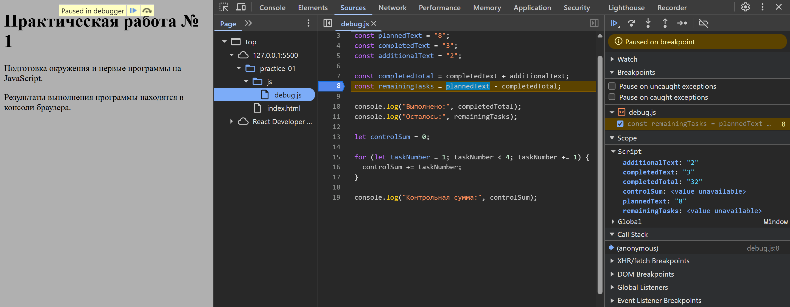
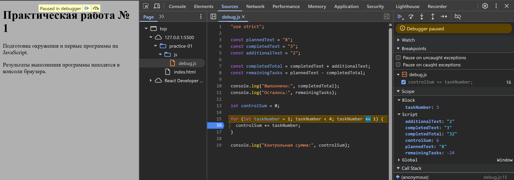

# Отчёт по практической работе № 1

## 1. Автор и вариант

- Автор: Назарова Виктория Александровна
- Группа: ЭФБО-04-25
- Вариант: 7

## 2. Окружение

- Операционная система: Windows 11 Домашняя 25H2
- Версия Node.js: v24.11.0
- Версия npm: 11.6.1
- Версия git: git version 2.51.2.windows.1
- Использованный браузер: Yandex

## 3. Запуск

Все команды выполняются из корня репозитория tip-js-practices:

```bash
node practice-01/js/hello.js
node practice-01/js/types.js
node practice-01/js/progress.js
node practice-01/js/plan.js
node practice-01/js/debug.js
node practice-01/js/progress-input.js
```

Для браузера: открыть practice-01/index.html, заменить путь в script на нужный файл, сохранить изменения, перезагрузить страницу и посмотреть Console. Все пять обязательных файлов должны работать в обоих окружениях; различие typeof document в первом задании ожидаемо.

## 4. Задание 1

- При запуске в браузере — Тип document: object
- При запуске через Node.js — Тип document: undefined

В браузере доступна объектная модель документа (DOM), поэтому глобальный объект document определён и имеет тип object. Node.js — это серверная среда выполнения, в ней нет HTML-страницы и DOM, поэтому document не определён и typeof возвращает undefined.

## 5. Задание 2. Таблица предсказаний, результатов, типов и объяснений

| №   | Выражение        | Ожидание до запуска | Фактическое значение | Тип результата | Объяснение                                                                                      |
| :-- | :--------------- | :------------------ | :------------------- | :------------- | :---------------------------------------------------------------------------------------------- |
| 1   | "8" + 2          | "82"                | "82"                 | string         | Оператор + со строкой выполняет конкатенацию: 2 превращается в "2".                             |
| 2   | "8" - 2          | 6                   | 6                    | number         | Оператор - приводит строку "8" к числу 8.                                                       |
| 3   | Number("8") + 2  | 10                  | 10                   | number         | Number("8") даёт 8, затем обычное сложение с 2.                                                 |
| 4   | "12" > "3"       | false               | false                | boolean        | Строки сравниваются лексикографически: "1" меньше "3", поэтому false.                           |
| 5   | 12 === "12"      | false               | false                | boolean        | Строгое сравнение учитывает тип: number и string не равны.                                      |
| 6   | Number("")       | 0                   | 0                    | number         | Пустая строка преобразуется в 0.                                                                |
| 7   | Number("text")   | NaN                 | NaN                  | number         | Строка не является числом, результат — NaN типа number.                                         |
| 8   | Boolean("false") | true                | true                 | boolean        | Любая непустая строка приводится к true, даже "false".                                          |
| 9   | typeof null      | "object"            | object               | string         | Историческая особенность: typeof null возвращает "object". Сам typeof всегда возвращает строку. |
| 10  | typeof NaN       | "number"            | number               | string         | NaN имеет тип number; typeof возвращает строку "number".                                        |

## 6. Задание 3. Таблица проверок

| Проверка            | Входные данные                        | Ожидаемый результат                               | Фактический результат                            | Итог     |
| :------------------ | :------------------------------------ | :------------------------------------------------ | :----------------------------------------------- | :------- |
| Мой вариант         | totalTasks = 10, completedTasks = 7   | Осталось 3; прогресс 70.0%; статус «В работе».    | Осталось 3; прогресс 70.0%; статус «В работе».   | Пройдено |
| Стандартный пример  | totalTasks = 12, completedTasks = 5   | Осталось 7; прогресс 41.7%; статус «В работе».    | Осталось 7; прогресс 41.7%; статус «В работе».   | Пройдено |
| Нулевые значения    | totalTasks = 0, completedTasks = 0    | Сообщение «Задач пока нет», без расчёта процента. | Сообщение «Задач пока нет».                      | Пройдено |
| Ничего не выполнено | totalTasks = 5, completedTasks = 0    | Осталось 5; прогресс 0.0%; статус «Не начато».    | Осталось 5; прогресс 0.0%; статус «Не начато».   | Пройдено |
| Всё выполнено       | totalTasks = 5, completedTasks = 5    | Осталось 0; прогресс 100.0%; статус «Завершено».  | Осталось 0; прогресс 100.0%; статус «Завершено». | Пройдено |
| Выполнено больше    | totalTasks = 5, completedTasks = 6    | Ошибка: выполнено больше, чем существует.         | Ошибка: выполнено больше, чем существует.        | Пройдено |
| Отрицательное число | totalTasks = -1, completedTasks = 0   | Ошибка: отрицательное количество.                 | Ошибка: отрицательное количество.                | Пройдено |
| Дробное число       | totalTasks = 5, completedTasks = 2.5  | Ошибка: дробное количество.                       | Ошибка: дробное количество.                      | Пройдено |
| Строка вместо числа | totalTasks = "5", completedTasks = 2  | Ошибка: вместо числа передана строка.             | Ошибка: вместо числа передана строка.            | Пройдено |
| Превышение границы  | totalTasks = 1001, completedTasks = 0 | Ошибка: превышена верхняя граница.                | Ошибка: превышена верхняя граница.               | Пройдено |
| Недопустимое число  | totalTasks = NaN, completedTasks = 0  | Ошибка: недопустимое числовое значение.           | Ошибка: недопустимое числовое значение.          | Пройдено |

## 7. Задание 4. Таблица проверок

| Проверка             | Входные данные | Ожидаемый результат                                               | Фактический результат                                                                                                                      | Итог     |
| :------------------- | :------------- | :---------------------------------------------------------------- | :----------------------------------------------------------------------------------------------------------------------------------------- | :------- |
| Мой вариант          | 10, 7, 3       | Осталось 3; День 1: выполнено 3, осталось 0; Потребуется дней: 1. | Осталось задач: 3. День 1: выполнено 3, осталось 0. Потребуется дней: 1.                                                                   | Пройдено |
| Стандартный пример   | 12, 5, 3       | 3 дня; в последний день выполнена 1 задача.                       | Осталось задач: 7. День 1: выполнено 3, осталось 4. День 2: выполнено 3, осталось 1. День 3: выполнено 1, осталось 0. Потребуется дней: 3. | Пройдено |
| Ровное деление       | 10, 4, 3       | 2 дня, по 3 задачи в день.                                        | Осталось задач: 6. День 1: выполнено 3, осталось 3. День 2: выполнено 3, осталось 0. Потребуется дней: 2.                                  | Пройдено |
| Норма больше остатка | 5, 3, 10       | 1 день, выполнено только 2 оставшиеся задачи.                     | Осталось задач: 2. День 1: выполнено 2, осталось 0. Потребуется дней: 1.                                                                   | Пройдено |
| Всё выполнено        | 5, 5, 2        | 0 дней; цикл не выполняется.                                      | Все задачи уже выполнены. Потребуется дней: 0.                                                                                             | Пройдено |
| Нет задач            | 0, 0, 2        | 0 дней; цикл не выполняется.                                      | Все задачи уже выполнены. Потребуется дней: 0.                                                                                             | Пройдено |
| Нулевая норма        | 5, 2, 0        | Ошибка; цикл не запускается.                                      | Ошибка: дневная норма должна быть не меньше 1.                                                                                             | Пройдено |
| Дробная норма        | 5, 2, 1.5      | Ошибка: дробной дневной нормы быть не должно.                     | Ошибка: дробной дневной нормы быть не должно.                                                                                              | Пройдено |
| Выполнено больше     | 5, 6, 2        | Ошибка: некорректное число выполненных задач.                     | Ошибка: некорректное число выполненных задач.                                                                                              | Пройдено |
| Норма — строка       | 5, 2, "2"      | Ошибка: дневная норма задана строкой.                             | Ошибка: дневная норма задана строкой.                                                                                                      | Пройдено |
| Превышение границы   | 5, 2, 1001     | Ошибка: превышена верхняя граница нормы.                          | Ошибка: превышена верхняя граница нормы.                                                                                                   | Пройдено |

## 8. Отладка

### 8.1. Исходный результат

- Выполнено: 32
- Осталось: -24
- Контрольная сумма: 6

### 8.2. Исправленный результат

- Выполнено: 5
- Осталось: 3
- Контрольная сумма: 10

### 8.3. Таблица анализа ошибок

| Ошибка                     | Что наблюдалось              | Причина                                                                                                                                                                                                                             | Исправление                                                                             | Результат после исправления |
| :------------------------- | :--------------------------- | :---------------------------------------------------------------------------------------------------------------------------------------------------------------------------------------------------------------------------------- | :-------------------------------------------------------------------------------------- | :-------------------------- |
| Обработка количества задач | Выполнено: 32, Осталось: -24 | Переменные completedText и additionalText содержат строки. Оператор + выполняет конкатенацию ("3" + "2" = "32"), а не арифметическое сложение. Далее строка "32" неявно преобразуется в число при вычитании, что даёт 8 - 32 = -24. | Явное преобразование строк в числа с помощью Number() перед арифметическими операциями. | Выполнено: 5, Осталось: 3   |
| Граница цикла              | Контрольная сумма: 6         | Условие продолжения цикла taskNumber < 4 не включает число 4. Цикл выполняется для 1, 2, 3 и прерывается, поэтому сумма равна 1 + 2 + 3 = 6.                                                                                        | Изменение условия на taskNumber <= 4.                                                   | Контрольная сумма: 10       |

### 8.4. Иллюстрации точек останова

#### 8.4.1. Ошибка обработки количества задач



_На скриншоте видна остановка на строке вычисления completedTotal. В панели Scope видно, что completedText: "3" и additionalText: "2" имеют тип string. Это доказывает, что до исправления оператор + выполнял конкатенацию строк, а не сложение чисел, из-за чего получалось "32" вместо 5._

#### 8.4.2. Ошибка границы цикла



_На скриншоте видна остановка внутри цикла на строке controlSum += taskNumber;. В панели Scope видно значение taskNumber: 3 и controlSum: 6. Условие taskNumber < 4 при следующем шаге станет ложным (4 < 4 даёт false), поэтому число 4 не будет прибавлено к сумме. Это объясняет, почему контрольная сумма равна 6, а не 10._

## 9. Расширение (вариант А). Данные поступают строками

В файле progress-input.js входные количества приходят как строки. Реализована следующая цепочка обработки: проверка типа, затем trim(), затем отклонение пустого ввода, затем Number(), затем Number.isFinite(), затем Number.isInteger(), затем ограничения задания 3.

### 9.1. Таблица проверок

| Проверка                    | Входные данные  | Ожидаемый результат                           | Фактический результат                         | Итог     |
| :-------------------------- | :-------------- | :-------------------------------------------- | :-------------------------------------------- | :------- |
| Обычные строки              | "10", "7"       | Осталось 3; прогресс 70.0%; статус «В работе» | Осталось 3; прогресс 70.0%; статус «В работе» | Пройдено |
| Строки с пробелами по краям | " 10 ", " 7 "   | Осталось 3; прогресс 70.0%                    | Осталось 3; прогресс 70.0%                    | Пройдено |
| Пустая строка               | "", "7"         | Ошибка: пустой ввод                           | Ошибка: пустой ввод                           | Пройдено |
| Строка из пробелов          | " ", "7"        | Ошибка: пустой ввод                           | Ошибка: пустой ввод                           | Пройдено |
| Не число                    | "abc", "7"      | Ошибка: недопустимое числовое значение        | Ошибка: недопустимое числовое значение        | Пройдено |
| Дробное число               | "10", "2.5"     | Ошибка: дробное количество                    | Ошибка: дробное количество                    | Пройдено |
| Infinity                    | "Infinity", "7" | Ошибка: недопустимое числовое значение        | Ошибка: недопустимое числовое значение        | Пройдено |
| null                        | null, "7"       | Ошибка: должен быть строкой                   | Ошибка: должен быть строкой                   | Пройдено |
| undefined                   | undefined, "7"  | Ошибка: должен быть строкой                   | Ошибка: должен быть строкой                   | Пройдено |
| Выполнено больше            | "5", "6"        | Ошибка: выполнено больше, чем существует      | Ошибка: выполнено больше, чем существует      | Пройдено |

### 9.2. Почему одной Number() и проверки на отрицательность недостаточно

Простой проверки «преобразовать через Number() и убедиться, что результат не отрицателен» недостаточно, потому что она пропускает несколько классов некорректных данных:

- Number("") даёт 0, и Number(" ") тоже даёт 0. Пустой ввод превратился бы в 0 и прошёл проверку.
- Number(null) даёт 0, а вызов null.trim() вообще выбросит исключение. Поэтому сначала нужна проверка typeof value === 'string'.
- Number("abc") даёт NaN. Сравнение NaN < 0 даёт false, поэтому проверка на отрицательность ошибку не отловит. Нужна отдельная проверка Number.isFinite().
- Number("2.5") даёт 2.5. Значение не отрицательное, но количество должно быть целым. Нужна проверка Number.isInteger().
- Number("Infinity") даёт Infinity. Значение тоже не отрицательное, но недопустимо как количество. Снова нужна проверка Number.isFinite().
- Number(" 12 ") даёт 12, но без предварительного trim() строка " " превратилась бы в 0, а не отклонилась как пустая.

Поэтому корректная последовательность такая: сначала проверка типа, затем trim(), затем проверка на пустую строку, затем Number(), затем isFinite(), затем isInteger(), затем ограничения диапазона. Только она гарантирует, что некорректный ввод будет отклонён без исключений и без молчаливого приёма за валидные данные.

## 10. Вывод

Освоены: различия сред Node.js и браузера, приведение типов (Number, isFinite, isInteger, trim), построение проверок до основного алгоритма, цикл while с Math.min(), отладка в DevTools.

**Показательная ошибка** — конкатенация строк в задании 5: "3" + "2" дало "32", а не 5. Без исключения, но с неверным результатом. Исправлено через Number(). Вторая ошибка — taskNumber < 4 вместо <= 4 (пропущено число 4).

**Расширение (вариант А):** входные данные — строки. Добавлены trim(), проверка на пустую строку, Number(), isFinite(), isInteger(). Проверены: обычные строки, пробелы по краям, пустая строка, строка из пробелов, "abc", "2.5", "Infinity", null, undefined. Все отклонены корректно, без исключений.
